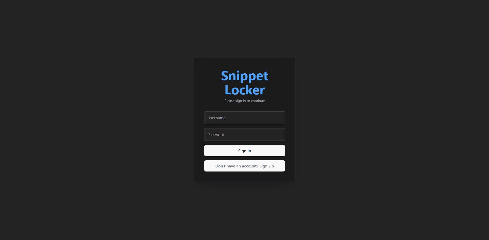
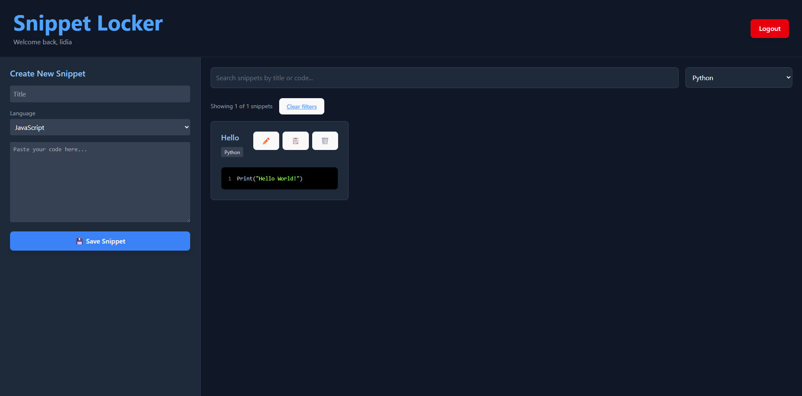

# Snippet Locker

Hey! This is my Snippet Locker. I built this because I got tired of constantly searching through old projects or random browser bookmarks just to find that one specific piece of code I use all the time. 

It’s a simple, clean place to "lock away" your favorite code snippets so you can find them exactly when you need them.

## How I built this
I wanted to practice building a "Full Stack" app, so I used:
* **Django (Python)** on the back end to handle data, authentication, and the API.
* **React** on the front end to make it feel fast and snappy.
* **Tailwind CSS** because I wanted it to look dark and modern without writing 500 lines of CSS.

## What it does right now
Save a snippet with a **title**, **code**, and **programming language**.  
* List all your snippets in a clean, searchable dashboard.  
* Edit snippets in a modal window without leaving the page.  
* Copy snippets to your clipboard with a simple click.  
* Delete snippets to keep things tidy.  
* Filter snippets by **language** or search by **title/code**.  
* Secure authentication: register, login, logout. Each user sees    only their own snippets.
* It's set up with environment variables, so the API URLs aren't hardcoded (keeps things secure!).

## Screenshots

### Login / Registration

*Sign in or register to access your snippets.*

### Main Dashboard
  
*All your snippets in one place. Filter, search, copy, edit, and delete easily.*

### Language Support / Filter

*List of languages supported with syntax highlighting*

## Want to run it yourself?
If you've cloned this, here is the "non-boring" guide to getting it started:

### 1. The Backend (The Brain)
Navigate to `/backend`, set up a virtual environment, and install the requirements:
`pip install -r requirements.txt`
Then, just run:
`python manage.py migrate`
`python manage.py runserver`

### 2. The Frontend (The Face)
In a new terminal, go to `/frontend`, install the stuff:
`npm install`

Create a .env file in the frontend folder and add your API URL:
VITE_API_URL=http://127.0.0.1:8000/api/
And fire it up:
`npm run dev`

## Tech Stack

* **Backend:** Django, Django REST Framework  
* **Frontend:** React, Tailwind CSS, Axios  
* **Authentication:** Token-based (Django REST Framework Auth)  
* **Database:** SQLite (default for Django, easy to swap later)
